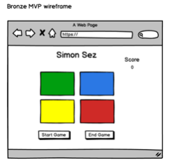

# Project Plan – Simon

## Purpose:

Simon is a test of memory. Have your program choose a sequence of different colors at random and then prompt your player repeat the sequence allowing them to go to advance to next round if the player is successful.

## Bonus:

- Add timer-based scoring
- Track scores across games (even if the page is reloaded)

# MVP - Bronze:

- Simple 4 square button interface with colors: red, green, blue, yellow
- Random sequence generated and stored in memory
- Sequence is displayed for the player one button at a time incrementing for each successful match of the sequence by the player
- Total number of successful matches are displayed on the screen
- Start game button to begin the sequence
- End game button to stop the game
- Failure message when incorrect sequence is pressed by the player
- Game ends when incorrect sequence is entered

 "bronze wireframe image"

## Bronze Pseudocode

### HTML:

- Use HTML5 boilerplate
- Link CSS and JS files
- H1 for Simon Sez heading
- Element for 2x2 grid with individual cells
- Start Game button
- End Game button
- Score label display
- core value display
- 2 Error message display element

### CSS:

- H1 style for heading
- H2 style for error display
- Grid style to create 2x2 grid
- Red style section
- Green style section
- Blue style section
- Yellow style section

### JS:

- Start new game function
  - Clear any stored sequences from previous game
  - Call random sequence generation
- End game function
- Set all colors back to original color
- Random sequence generation function
  - A win is defined as 20 correct matches
  - Array size should be 20
- Function for capturing user selections
- function to evaluate user selection to determine match or error
- Function to highlight color sequence with time interval between colors
  - Don’t allow player to click on any buttons while computer is flashing sequence
- Function to count and display number of correct matches
- Function to display error message for incorrect selection
