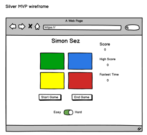
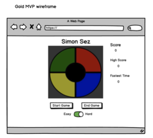

# Project Plan – Simon

## Purpose:

Simon is a test of memory. Have your program choose a sequence of different colors at random and then prompt your player repeat the sequence allowing them to go to advance to next round if the player is successful.

## Bonus:

- Add timer-based scoring
- Track scores across games (even if the page is reloaded)

# MVP - Bronze:

- Simple 4 square button interface with colors: red, green, blue, yellow
- Random sequence generated and stored in memory
- Sequence is displayed for the player one button at a time incrementing for each successful match of the sequence by the player
- Total number of successful matches are displayed on the screen
- Start game button to begin the sequence
- End game button to stop the game
- Failure message when incorrect sequence is pressed by the player
- Game ends when incorrect sequence is entered

 "bronze wireframe image"

## Bronze Pseudocode

### HTML:

- Use HTML5 boilerplate
- Link CSS and JS files
- H1 for Simon Sez heading
- Element for 2x2 grid with individual cells
- Start Game button
- End Game button
- Score label display
- Score value display
- H2 Error message display element

### CSS:

- H1 style for heading
- H2 style for error display
- Grid style to create 2x2 grid
- Red style section
- Green style section
- Blue style section
- Yellow style section

### JS:

- Start new game function
  - Clear any stored sequences from previous game
  - Call random sequence generation
- End game function
- Set all colors back to original color
- Random sequence generation function
  - A win is defined as 20 correct matches
  - Array size should be 20
- Function for capturing user selections
- function to evaluate user selection to determine match or error
- Function to highlight color sequence with time interval between colors
  - Don’t allow player to click on any buttons while computer is flashing sequence
- Function to count and display number of correct matches
- Function to display error message for incorrect selection

# MVP -Silver:

- Track highest score achieved for the current player – Move to Gold
- Add timer-based scoring – Move to Gold
- Simple/Hard mode selection – simple mode allows player to retry 3 times to get correct sequence before game ends.
- Player wins after 20 successful matches

 "silver wireframe image"

## Silver Pseudocode:

### HTML:

- Add High Score tag
- Add Elapsed time tag– Move to Gold
- Add Record time tag– Move to Gold
- Add Easy/Hard tag

### CSS:

- Update CSS as required for new tags

### JS:

- High Score
  - Create high score variable
  - Create function to check current level against high score and update if new high score
  - Display high score on screen
- Record Time– Move to Gold
  - Create fastest time variable
  - Display fastest time on screen
- Elapsed Time– Move to Gold
  - Create timer function
    - [title](https://www.ostraining.com/blog/coding/stopwatch/)
    - [title](https://stackoverflow.com/questions/20318822/how-to-create-a-stopwatch-using-javascript)
    - [title](https://jsfiddle.net/Daniel_Hug/pvk6p/)
  - Display timer on screen
- Easy/Hard
  - Create skill level variable
  - If hard – end game after incorrect sequence
  - If easy – computer displays current level again and repeats 3 times. Game ends after 3rd incorrect pick
- 20 Match win
  - Add needed conditions to check for win and display message

# MVP - Gold:

- Revise UI to match layout of traditional Simon game
- Add sound to game
  - one tone for each color
  - sound for incorrect match
  - sound when clicking button
- Track highest score across games even if the page is reloaded

 "gold wireframe image"

## Gold Pseudocode

### HTML:

- Sounds
  - Add sound tags
- Classic game look
  - Turn squares into quarter circles
  - Add inner circle element
  - Add power button
  - Move level and high score displays to center

### CSS:

- Classic game look
  - Turn squares into quarter circles
  - Add inner circle element
  - Add elements to support HTML changes

### JS:

- Sounds
  - Add document selector and play() code
- Classic game look
  - Add power button
